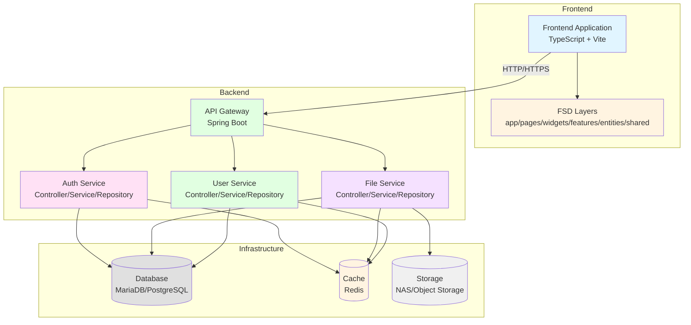
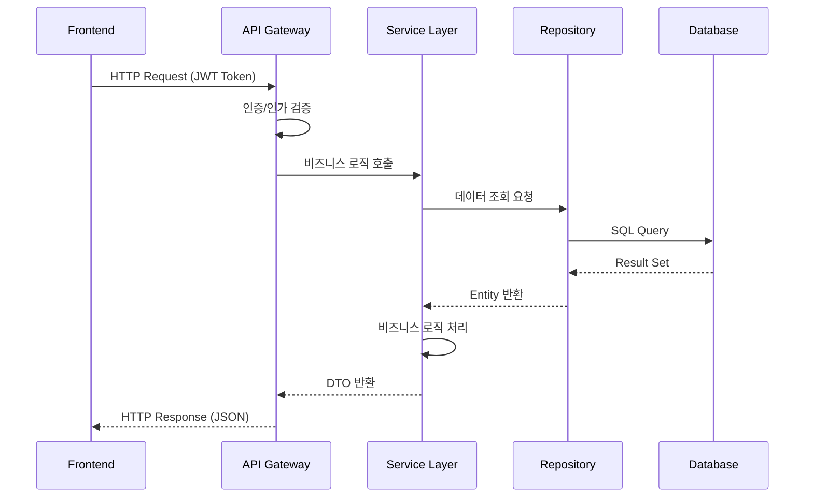
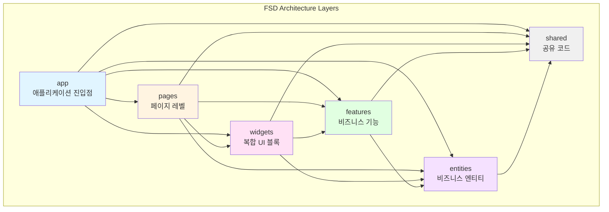
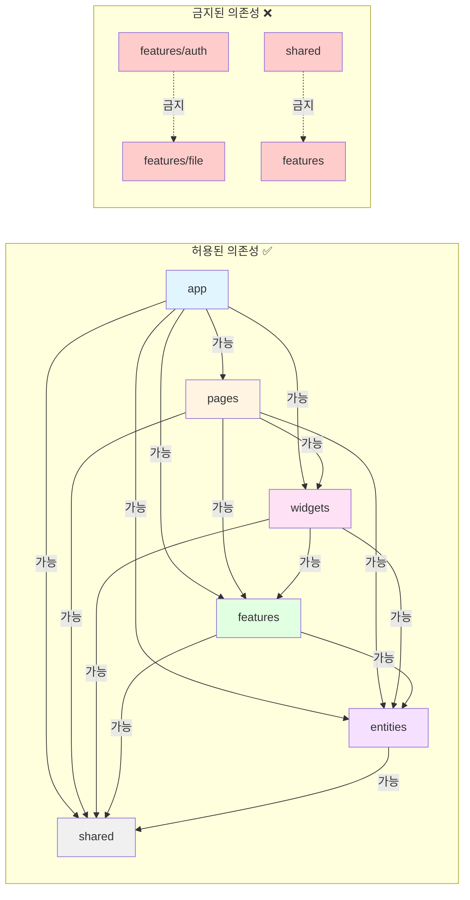
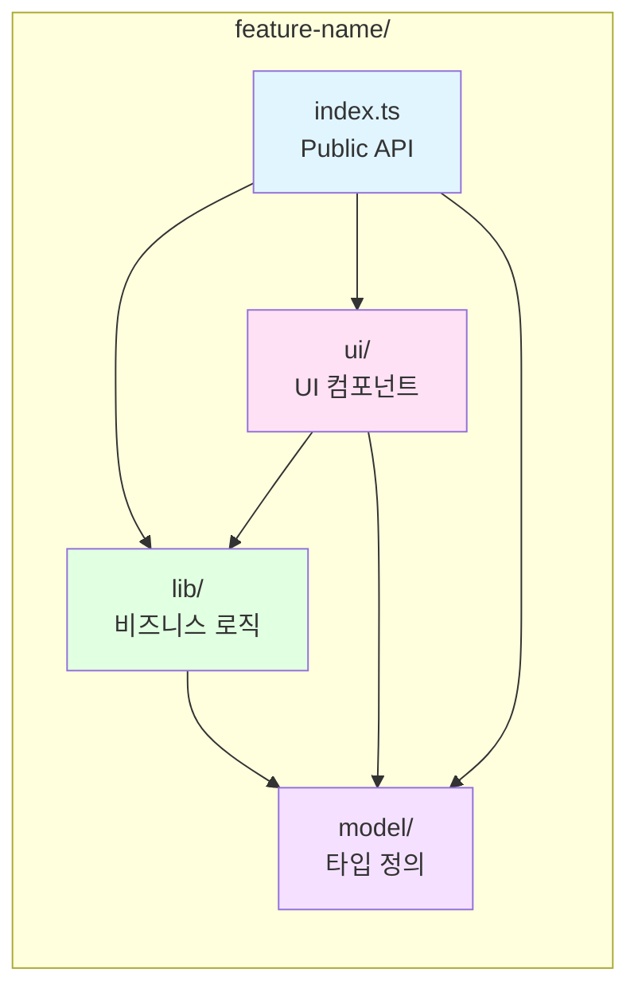
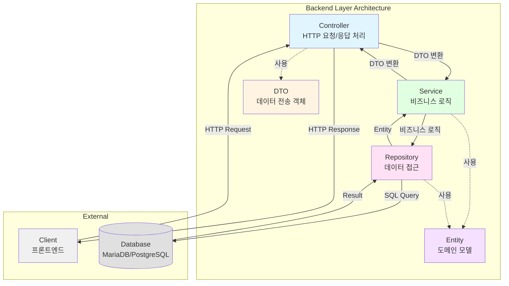
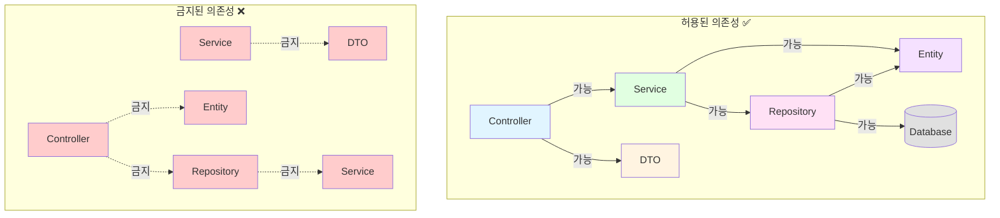
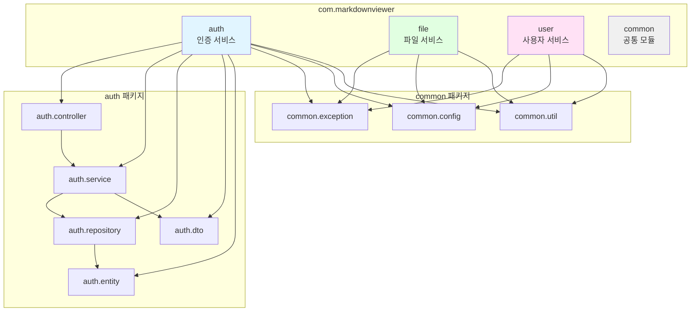

# 코딩 규약 및 스타일 가이드

## 문서 정보
- **프로젝트**: 마크다운 뷰어 V2
- **버전**: 1.0
- **작성일**: 2026-02-02
- **대상**: 프론트엔드 및 백엔드 개발자

## 목차
1. [아키텍처 관점도](#아키텍처-관점도)
2. [일반 원칙](#일반-원칙)
3. [개발 관점 및 핵심 원칙](#개발-관점-및-핵심-원칙)
   - [프론트엔드 개발 관점](#프론트엔드-개발-관점)
   - [백엔드 개발 관점](#백엔드-개발-관점)
   - [개발 우선순위](#개발-우선순위)
4. [프론트엔드 규약](#프론트엔드-규약)
   - [TypeScript 규칙](#typescript-규칙)
   - [FSD 아키텍처 규칙](#fsd-아키텍처-규칙)
   - [네이밍 컨벤션](#네이밍-컨벤션-프론트엔드)
   - [파일 구조 규칙](#파일-구조-규칙-프론트엔드)
   - [코드 스타일](#코드-스타일-프론트엔드)
   - [CSS 스타일 규칙](#css-스타일-규칙)
4. [백엔드 규약](#백엔드-규약)
   - [Java 코딩 규칙](#java-코딩-규칙)
   - [Spring Boot 규칙](#spring-boot-규칙)
   - [네이밍 컨벤션](#네이밍-컨벤션-백엔드)
   - [패키지 구조 규칙](#패키지-구조-규칙)
   - [코드 스타일](#코드-스타일-백엔드)
   - [데이터베이스 규칙](#데이터베이스-규칙)
5. [공통 규칙](#공통-규칙)
   - [주석 및 문서화](#주석-및-문서화)
   - [에러 처리](#에러-처리)
   - [커밋 메시지 규칙](#커밋-메시지-규칙)

---

## 아키텍처 관점도

### 전체 시스템 아키텍처



### 프론트엔드-백엔드 통신 흐름



---

## 일반 원칙

### 1. 가독성 우선
- 코드는 읽기 쉬워야 합니다
- 복잡한 로직은 주석으로 설명하거나 함수/메서드로 분리합니다
- 매직 넘버/문자열은 상수로 정의합니다

### 2. 일관성 유지
- 프로젝트 전체에서 동일한 패턴을 사용합니다
- 기존 코드 스타일을 따릅니다
- 팀원과의 코드 리뷰를 통해 일관성을 유지합니다

### 3. 단순성
- 과도한 추상화를 피합니다
- YAGNI (You Aren't Gonna Need It) 원칙을 따릅니다
- 명확하고 직관적인 코드를 작성합니다

### 4. 타입 안정성
- **프론트엔드**: TypeScript의 타입 시스템을 적극 활용
- **백엔드**: Java의 타입 시스템과 제네릭 활용

---

## 개발 관점 및 핵심 원칙

### 프론트엔드 개발 관점

프론트엔드 개발은 **사용자 경험(UX)과 인터페이스(UI)를 중심**으로 설계되며, 다음 원칙을 준수합니다:

#### 1. 사용자 경험(UX) 및 인터페이스(UI) 중심

##### 시각적 구현
- **디자이너 의도 반영**: 디자이너의 의도를 정확히 파악하여 구현
- **반응형 웹 디자인**: 다양한 화면 크기에 대응하는 반응형 레이아웃 적용
- **직관적인 UI**: 사용자가 쉽게 이해하고 사용할 수 있는 인터페이스 설계

##### 상호작용(Interaction)
- **자연스러운 애니메이션**: 버튼 클릭, 페이지 전환 등 부드러운 전환 효과
- **빠른 응답성**: 사용자 액션에 즉각적인 피드백 제공
- **로딩 상태 표시**: 비동기 작업 중 명확한 로딩 인디케이터 제공

#### 2. 성능 및 최적화

##### 로딩 속도
- **이미지 최적화**: WebP 형식 사용, lazy loading 적용
- **코드 분할(Code Splitting)**: 라우트별 또는 기능별 코드 분할로 초기 로딩 시간 단축
- **캐싱 전략**: 브라우저 캐싱, Service Worker 활용
- **번들 크기 최적화**: 불필요한 라이브러리 제거, Tree Shaking 적용

##### 비동기 처리
- **효율적인 로딩 상태 관리**: API 호출 시 로딩 상태를 명확히 표시
- **에러 처리**: 네트워크 오류, 타임아웃 등에 대한 사용자 친화적 메시지
- **낙관적 업데이트(Optimistic Update)**: 가능한 경우 즉시 UI 업데이트 후 서버 동기화

#### 3. 기술적 아키텍처 및 유지보수

##### 관심사의 분리(SoC - Separation of Concerns)
- **UI 로직**: 프레젠테이션 레이어 (컴포넌트, 스타일)
- **비즈니스 로직**: 도메인 로직 (features 레이어)
- **데이터 관리**: 상태 관리, API 통신 (entities, shared 레이어)

##### 컴포넌트 기반 개발
- **재사용성(Reusability)**: 공통 컴포넌트를 `shared/ui`에 배치
- **변경에 유연한 구조**: Props 기반으로 다양한 상황에 대응
- **단일 책임 원칙**: 각 컴포넌트는 하나의 명확한 역할만 수행

##### FSD(Feature-Sliced Design)
- **기능 단위 모듈화**: `features` 레이어에서 기능별로 독립적인 모듈 구성
- **복잡성 관리**: 레이어 간 의존성 규칙으로 복잡도 제어
- **확장성**: 새로운 기능 추가 시 기존 코드에 영향 최소화

#### 4. 호환성 및 안정성

##### 크로스 브라우징
- **브라우저 호환성**: Chrome, Safari, Edge, Firefox 최신 2개 버전 지원
- **기기 호환성**: 데스크톱, 태블릿, 모바일에서 동일한 사용자 경험 제공
- **점진적 향상(Progressive Enhancement)**: 기본 기능은 모든 브라우저에서 동작, 고급 기능은 지원 브라우저에서만 활성화

##### 보안
- **XSS 방지**: 사용자 입력 검증 및 이스케이프 처리
- **CSRF 방지**: 토큰 기반 인증 사용
- **민감 정보 보호**: 클라이언트 사이드에 민감 정보 저장 금지
- **의존성 보안**: 정기적인 보안 업데이트 및 취약점 스캔

---

### 백엔드 개발 관점

백엔드 개발은 **데이터 중심 설계와 시스템 안정성**을 중심으로 설계되며, 다음 원칙을 준수합니다:

#### 1. 데이터 중심 설계 (Data Management)

##### 데이터베이스 구조 설계
- **정규화**: 데이터 중복 최소화 및 무결성 보장
- **인덱싱 전략**: 자주 조회되는 컬럼에 인덱스 적용
- **쿼리 최적화**: N+1 문제 방지, JOIN 최적화
- **트랜잭션 관리**: 데이터 일관성 보장

##### 데이터 접근 패턴
- **Repository 패턴**: 데이터 접근 로직 캡슐화
- **DTO 활용**: 엔티티와 API 응답 분리
- **페이징 처리**: 대용량 데이터 조회 시 페이징 적용

#### 2. API 및 비즈니스 로직 구현

##### RESTful API 설계
- **REST 원칙 준수**: 리소스 기반 URL 설계
- **HTTP 메서드 적절한 사용**: GET, POST, PUT, DELETE 등
- **상태 코드 활용**: 적절한 HTTP 상태 코드 반환
- **API 버전 관리**: `/api/v1/` 형식으로 버전 관리

##### 비즈니스 로직 처리
- **Service 레이어**: 복잡한 비즈니스 로직을 Service에서 처리
- **도메인 모델**: 엔티티에 비즈니스 규칙 포함
- **유효성 검증**: 입력 데이터 검증 및 예외 처리

#### 3. 시스템 안정성 및 성능 최적화

##### 서버 성능 최적화
- **캐싱 전략**: Redis를 활용한 분산 캐싱
- **연결 풀 관리**: HikariCP 등 연결 풀 최적화
- **비동기 처리**: MQ(RabbitMQ/Kafka)를 통한 비동기 작업 처리
- **로드 밸런싱**: 다중 인스턴스 배포 및 부하 분산

##### 병목 현상 방지
- **데이터베이스 최적화**: 쿼리 성능 모니터링 및 튜닝
- **동시성 제어**: 트랜잭션 격리 수준 적절히 설정
- **리소스 모니터링**: CPU, 메모리, 디스크 I/O 모니터링

#### 4. 유지보수 가능한 구조 (Architecture)

##### 레이어 분리
- **Controller**: HTTP 요청/응답 처리, DTO 변환
- **Service**: 비즈니스 로직 처리
- **Repository**: 데이터 접근 로직
- **각 레이어의 명확한 책임 분리**

##### SOLID 원칙 준수

**S - Single Responsibility Principle (단일 책임 원칙)**

각 클래스는 하나의 책임만 가져야 합니다.

```java
// ✅ 좋은 예: 각 클래스가 하나의 책임만 가짐
@Service
public class UserService {
    private final UserRepository userRepository;
    
    public User findById(String id) {
        return userRepository.findById(id).orElseThrow();
    }
    
    public User createUser(UserCreateRequest request) {
        // 비즈니스 로직만 처리
        User user = new User(request.getEmail(), request.getName());
        return userRepository.save(user);
    }
}

@Repository
public interface UserRepository extends JpaRepository<User, Long> {
    // 데이터 접근 로직만
}

// ❌ 나쁜 예: 여러 책임을 가진 클래스
@Service
public class UserService {
    public User findById(String id) { /* ... */ }
    public void sendEmail(User user) { /* 이메일 전송은 별도 서비스로 분리해야 함 */ }
    public void generateReport(User user) { /* 리포트 생성도 별도 서비스로 분리해야 함 */ }
}
```

**O - Open/Closed Principle (개방-폐쇄 원칙)**

확장에는 열려있고 수정에는 닫혀있어야 합니다.

```java
// ✅ 좋은 예: 인터페이스 기반 설계로 확장 가능
public interface PaymentProcessor {
    void processPayment(BigDecimal amount);
}

@Service
public class CreditCardProcessor implements PaymentProcessor {
    @Override
    public void processPayment(BigDecimal amount) {
        // 신용카드 결제 로직
    }
}

@Service
public class BankTransferProcessor implements PaymentProcessor {
    @Override
    public void processPayment(BigDecimal amount) {
        // 계좌이체 결제 로직
    }
}

// 새로운 결제 방식 추가 시 기존 코드 수정 없이 확장 가능
@Service
public class CryptoProcessor implements PaymentProcessor {
    @Override
    public void processPayment(BigDecimal amount) {
        // 암호화폐 결제 로직
    }
}
```

**L - Liskov Substitution Principle (리스코프 치환 원칙)**

하위 타입은 상위 타입을 대체할 수 있어야 합니다.

```java
// ✅ 좋은 예: 인터페이스 계약 준수
public interface FileStorage {
    void save(String path, byte[] data);
    byte[] load(String path);
}

@Service
public class LocalFileStorage implements FileStorage {
    @Override
    public void save(String path, byte[] data) {
        // 로컬 파일 시스템에 저장
    }
    
    @Override
    public byte[] load(String path) {
        // 로컬 파일 시스템에서 로드
        return new byte[0];
    }
}

@Service
public class S3FileStorage implements FileStorage {
    @Override
    public void save(String path, byte[] data) {
        // S3에 저장
    }
    
    @Override
    public byte[] load(String path) {
        // S3에서 로드
        return new byte[0];
    }
}

// FileStorage 인터페이스를 사용하는 코드는 어떤 구현체든 대체 가능
@Service
public class FileService {
    private final FileStorage fileStorage;
    
    public FileService(FileStorage fileStorage) {
        this.fileStorage = fileStorage;
    }
    
    public void saveFile(String path, byte[] data) {
        fileStorage.save(path, data); // LocalFileStorage든 S3FileStorage든 동일하게 동작
    }
}
```

**I - Interface Segregation Principle (인터페이스 분리 원칙)**

클라이언트가 사용하지 않는 메서드에 의존하지 않아야 합니다.

```java
// ❌ 나쁜 예: 거대한 인터페이스
public interface UserRepository {
    User findById(Long id);
    User findByEmail(String email);
    void save(User user);
    void delete(Long id);
    void sendEmail(User user); // Repository가 이메일 전송 책임을 가짐
    void generateReport(User user); // Repository가 리포트 생성 책임을 가짐
}

// ✅ 좋은 예: 작고 구체적인 인터페이스로 분리
public interface UserRepository extends JpaRepository<User, Long> {
    Optional<User> findByEmail(String email);
    // 데이터 접근 관련 메서드만
}

public interface EmailService {
    void sendEmail(User user);
    // 이메일 전송 관련 메서드만
}

public interface ReportService {
    void generateReport(User user);
    // 리포트 생성 관련 메서드만
}
```

**D - Dependency Inversion Principle (의존성 역전 원칙)**

고수준 모듈은 저수준 모듈에 의존하지 않아야 합니다.

```java
// ❌ 나쁜 예: 고수준 모듈이 저수준 모듈에 직접 의존
@Service
public class UserService {
    private final MariaDbUserRepository userRepository; // 구체 클래스에 의존
    
    public UserService(MariaDbUserRepository userRepository) {
        this.userRepository = userRepository;
    }
}

// ✅ 좋은 예: 인터페이스(추상화)에 의존
@Service
public class UserService {
    private final UserRepository userRepository; // 인터페이스에 의존
    
    public UserService(UserRepository userRepository) {
        this.userRepository = userRepository;
    }
    
    public User findById(Long id) {
        return userRepository.findById(id).orElseThrow();
    }
}

// 인터페이스 정의
public interface UserRepository extends JpaRepository<User, Long> {
    Optional<User> findByEmail(String email);
}

// Spring Data JPA가 자동으로 구현체 생성 (프록시)
// 필요시 커스텀 구현도 가능
@Repository
public class CustomUserRepository implements UserRepository {
    // 커스텀 구현
}
```

##### 테스트 용이성
- **단위 테스트**: 각 레이어별 독립적인 테스트 작성
- **통합 테스트**: API 엔드포인트 테스트
- **Mock 활용**: 외부 의존성 Mock 처리

#### 5. 보안 (Security)

##### 인증 및 인가
- **JWT 토큰**: 상태 없는 인증 방식
- **Spring Security**: 보안 필터 체인 구성
- **역할 기반 접근 제어(RBAC)**: 사용자 권한 관리

##### 데이터 보호
- **SQL Injection 방지**: PreparedStatement, JPA 사용
- **XSS 방지**: 입력 데이터 검증 및 이스케이프
- **CSRF 방지**: 토큰 기반 CSRF 보호
- **암호화**: 민감 정보 암호화 저장

##### 보안 모니터링
- **로그 관리**: 보안 이벤트 로깅
- **예외 처리**: 보안 예외는 상세 정보 노출 금지
- **정기 보안 점검**: 취약점 스캔 및 업데이트

#### 6. 확장성 (Scalability)

##### 수평 확장(Horizontal Scaling)
- **무상태(Stateless) 설계**: 세션 정보를 외부 저장소에 저장
- **로드 밸런싱**: 다중 인스턴스 배포
- **분산 캐싱**: Redis Cluster 활용

##### 수직 확장(Vertical Scaling)
- **리소스 모니터링**: CPU, 메모리 사용량 추적
- **성능 튜닝**: 쿼리 최적화, 인덱싱 전략

##### 마이크로서비스 아키텍처
- **서비스 분리**: 기능별 독립적인 서비스 구성
- **API Gateway**: 단일 진입점 제공
- **서비스 간 통신**: REST API 또는 Message Queue 활용

---

## 개발 우선순위

### 프론트엔드 우선순위

1. **사용자 경험** (최우선)
   - 직관적인 UI/UX
   - 빠른 로딩 속도
   - 자연스러운 상호작용

2. **성능 최적화**
   - 코드 분할
   - 이미지 최적화
   - 캐싱 전략

3. **아키텍처**
   - FSD 구조 준수
   - 컴포넌트 재사용성
   - 관심사 분리

4. **호환성 및 보안**
   - 크로스 브라우징
   - 보안 취약점 방지

### 백엔드 우선순위

1. **안정성 및 성능** (최우선)
   - 시스템 안정성
   - 성능 최적화
   - 확장성

2. **아키텍처 및 유지보수성**
   - SOLID 원칙 준수
   - 레이어 분리
   - 테스트 용이성

3. **보안**
   - 인증/인가
   - 데이터 보호
   - 보안 모니터링

4. **데이터 관리**
   - 효율적인 데이터베이스 설계
   - 쿼리 최적화
   - 트랜잭션 관리

---

## 프론트엔드 규약

### TypeScript 규칙

#### 타입 정의

##### ✅ 좋은 예
```typescript
// 명시적 타입 정의
interface User {
  id: string;
  email: string;
  name: string;
}

// 제네릭 활용
function getItem<T>(key: string): T | null {
  const item = localStorage.getItem(key);
  return item ? JSON.parse(item) : null;
}
```

##### ❌ 나쁜 예
```typescript
// any 사용
function processData(data: any): any {
  return data;
}

// 타입 없이 사용
function getUser(id) {
  return users.find(u => u.id === id);
}
```

#### 타입 가드

```typescript
// 타입 가드 함수 사용
function isUser(obj: unknown): obj is User {
  return (
    typeof obj === 'object' &&
    obj !== null &&
    'id' in obj &&
    'email' in obj
  );
}

// 사용 예시
if (isUser(data)) {
  console.log(data.email); // 타입 안전
}
```

#### 엄격한 타입 체크

- `strict: true` 모드 사용
- `noUnusedLocals`, `noUnusedParameters` 활성화
- `noUncheckedIndexedAccess` 사용으로 배열/객체 접근 안전성 확보

---

### FSD 아키텍처 규칙

#### 레이어 구조

```
src/
├── app/          # 애플리케이션 진입점 및 초기화
├── pages/        # 페이지 레벨 컴포넌트
├── widgets/      # 복합 UI 블록
├── features/     # 비즈니스 기능
├── entities/     # 비즈니스 엔티티
└── shared/       # 공유 코드
```

#### FSD 레이어 구조 관점도



#### 레이어 간 의존성 규칙

1. **상위 레이어는 하위 레이어만 참조 가능**
   - `app` → `pages`, `widgets`, `features`, `entities`, `shared`
   - `pages` → `widgets`, `features`, `entities`, `shared`
   - `widgets` → `features`, `entities`, `shared`
   - `features` → `entities`, `shared`
   - `entities` → `shared`
   - `shared` → (의존성 없음)

2. **같은 레이어 내에서는 서로 참조 불가**
   - `features/auth` → `features/file-management` ❌

3. **하위 레이어는 상위 레이어 참조 불가**
   - `shared` → `features` ❌

#### 의존성 규칙 관점도



#### Feature 구조 관점도



#### Import 경로 규칙

##### ✅ 좋은 예
```typescript
// Path alias 사용
import { apiClient } from '@shared/api/client';
import { User } from '@entities/user';
import { AuthFeature } from '@features/auth';
```

##### ❌ 나쁜 예
```typescript
// 상대 경로 남용
import { apiClient } from '../../../shared/api/client';
```

#### 폴더 구조 규칙

각 feature/entity는 다음 구조를 따릅니다:

```
feature-name/
├── index.ts          # Public API (export)
├── lib/              # 비즈니스 로직
│   └── service.ts
├── ui/               # UI 컴포넌트
│   ├── Component.ts
│   └── Component.css
└── model/            # 타입 정의 (필요시)
    └── types.ts
```

---

### 네이밍 컨벤션 (프론트엔드)

#### 파일 및 폴더

- **파일명**: PascalCase (컴포넌트), camelCase (유틸리티)
  - `Button.ts`, `MarkdownRenderer.ts` ✅
  - `button.ts`, `markdown-renderer.ts` ❌

- **폴더명**: kebab-case
  - `markdown-renderer/`, `file-management/` ✅
  - `markdownRenderer/`, `FileManagement/` ❌

#### 변수 및 함수

- **변수**: camelCase
  ```typescript
  const userName = 'John';
  const fileList = [];
  ```

- **함수**: camelCase, 동사로 시작
  ```typescript
  function getUserData() {}
  function renderMarkdown() {}
  function handleClick() {}
  ```

- **상수**: UPPER_SNAKE_CASE
  ```typescript
  const API_BASE_URL = '/api';
  const MAX_FILE_SIZE = 16 * 1024 * 1024;
  ```

- **클래스**: PascalCase
  ```typescript
  class MarkdownRenderer {}
  class ApiClient {}
  ```

- **인터페이스/타입**: PascalCase
  ```typescript
  interface User {}
  type SaveStatus = 'saved' | 'saving';
  ```

#### 이벤트 핸들러

- `handle` 접두사 사용
  ```typescript
  function handleClick() {}
  function handleSubmit() {}
  function handleFileUpload() {}
  ```

#### Boolean 변수

- `is`, `has`, `should`, `can` 접두사 사용
  ```typescript
  const isOpen = true;
  const hasError = false;
  const shouldSave = true;
  const canEdit = false;
  ```

---

### 파일 구조 규칙 (프론트엔드)

#### 컴포넌트 파일 구조

```typescript
/**
 * 컴포넌트 설명
 * 간단한 한 줄 설명
 */

// 1. Import (외부 라이브러리 → 내부 모듈 순서)
import { marked } from 'marked';
import { apiClient } from '@shared/api/client';
import { User } from '@entities/user';

// 2. 타입 정의 (해당 파일에서만 사용하는 경우)
interface ComponentProps {
  // ...
}

// 3. 클래스/함수 정의
export class Component {
  // ...
}

// 4. CSS Import (마지막)
import './Component.css';
```

#### Index 파일 규칙

각 폴더의 `index.ts`는 Public API만 export합니다:

```typescript
// ✅ 좋은 예
export { MarkdownRenderer } from './ui/MarkdownRenderer';
export { renderMarkdown } from './lib/markdown';

// ❌ 나쁜 예 (내부 구현 노출)
export { MarkdownRenderer } from './ui/MarkdownRenderer';
export { internalHelper } from './lib/helper'; // 내부 함수
```

---

### 코드 스타일 (프론트엔드)

#### 들여쓰기 및 공백

- **들여쓰기**: 2 spaces (탭 사용 금지)
- **줄 끝 공백**: 제거
- **파일 끝**: 빈 줄 하나

#### 중괄호 및 세미콜론

- **중괄호**: 항상 사용 (한 줄 if문도)
  ```typescript
  // ✅ 좋은 예
  if (condition) {
    doSomething();
  }

  // ❌ 나쁜 예
  if (condition) doSomething();
  ```

- **세미콜론**: 항상 사용
  ```typescript
  const name = 'John';
  function greet() {
    return 'Hello';
  }
  ```

#### 문자열

- **작은따옴표 사용** (일관성)
  ```typescript
  const message = 'Hello, World!';
  ```

- **템플릿 리터럴**: 변수 삽입 시에만 사용
  ```typescript
  const name = 'John';
  const greeting = `Hello, ${name}!`;
  ```

#### 배열 및 객체

- **배열**: 간단한 경우 한 줄, 복잡한 경우 여러 줄
  ```typescript
  const numbers = [1, 2, 3];
  const users = [
    { id: '1', name: 'John' },
    { id: '2', name: 'Jane' },
  ];
  ```

- **객체**: 마지막 속성 뒤 쉼표 (trailing comma)
  ```typescript
  const user = {
    id: '1',
    name: 'John',
    email: 'john@example.com', // trailing comma
  };
  ```

#### 함수

- **화살표 함수**: 간단한 함수, 콜백
  ```typescript
  const add = (a: number, b: number) => a + b;
  items.map(item => item.id);
  ```

- **일반 함수**: 복잡한 로직, 메서드
  ```typescript
  function processData(data: Data): Result {
    // 복잡한 로직
    return result;
  }
  ```

#### 비동기 처리

- **async/await 사용** (Promise.then() 지양)
  ```typescript
  // ✅ 좋은 예
  async function fetchUser() {
    try {
      const response = await apiClient.get('/users/me');
      return response.data;
    } catch (error) {
      console.error('Failed to fetch user:', error);
      throw error;
    }
  }

  // ❌ 나쁜 예
  function fetchUser() {
    return apiClient.get('/users/me')
      .then(response => response.data)
      .catch(error => {
        console.error('Failed to fetch user:', error);
        throw error;
      });
  }
  ```

---

### CSS 스타일 규칙

#### CSS 변수 사용

- CSS 변수(Custom Properties)를 적극 활용
  ```css
  :root {
    --text-primary: #000000;
    --bg-primary: #ffffff;
    --spacing-md: 16px;
  }
  ```

#### 클래스 네이밍

- **BEM 스타일 권장** (선택사항)
  ```css
  .markdown-renderer {}
  .markdown-renderer__header {}
  .markdown-renderer__header--active {}
  ```

- **또는 컴포넌트 단위 네이밍**
  ```css
  .markdown-renderer {}
  .markdown-renderer-header {}
  .markdown-renderer-header-active {}
  ```

#### 반응형 디자인

- **모바일 퍼스트 접근**
  ```css
  /* 기본: 모바일 */
  .container {
    padding: var(--spacing-md);
  }

  /* 태블릿 이상 */
  @media (min-width: 768px) {
    .container {
      padding: var(--spacing-lg);
    }
  }
  ```

---

## 백엔드 규약

### Java 코딩 규칙

#### 기본 규칙

- **Java 버전**: Java 17 이상 (Spring Boot 3.x 요구사항)
- **코드 포맷팅**: Google Java Style Guide 또는 Oracle Java Code Conventions 준수
- **들여쓰기**: 4 spaces (탭 사용 금지)
- **라인 길이**: 최대 120자

#### 클래스 및 인터페이스

##### ✅ 좋은 예
```java
/**
 * 사용자 서비스 클래스
 * 사용자 관련 비즈니스 로직을 처리합니다.
 */
@Service
@RequiredArgsConstructor
public class UserService {
    
    private final UserRepository userRepository;
    
    /**
     * 사용자 ID로 사용자 정보를 조회합니다.
     * 
     * @param userId 사용자 ID
     * @return 사용자 정보
     * @throws UserNotFoundException 사용자를 찾을 수 없는 경우
     */
    public User findById(String userId) {
        return userRepository.findById(userId)
            .orElseThrow(() -> new UserNotFoundException(userId));
    }
}
```

##### ❌ 나쁜 예
```java
// 주석 없음, 필드 주입 사용
@Service
public class UserService {
    @Autowired
    UserRepository userRepository;
    
    public User findById(String userId) {
        return userRepository.findById(userId).get(); // Optional 처리 없음
    }
}
```

#### 제네릭 사용

- **제네릭을 적극 활용**하여 타입 안정성 확보
  ```java
  // ✅ 좋은 예
  public <T> Optional<T> findById(String id, Class<T> clazz) {
      // ...
  }

  // ❌ 나쁜 예
  public Object findById(String id) {
      // ...
  }
  ```

#### Optional 사용

- **Optional을 적절히 활용**하여 null 안전성 확보
  ```java
  // ✅ 좋은 예
  public Optional<User> findByEmail(String email) {
      return userRepository.findByEmail(email);
  }

  // 사용 시
  userService.findByEmail(email)
      .ifPresent(user -> processUser(user));
  ```

---

### Spring Boot 규칙

#### 의존성 주입

- **생성자 주입 사용** (필드 주입 지양)
  ```java
  // ✅ 좋은 예
  @Service
  @RequiredArgsConstructor
  public class UserService {
      private final UserRepository userRepository;
      private final EmailService emailService;
  }

  // ❌ 나쁜 예
  @Service
  public class UserService {
      @Autowired
      private UserRepository userRepository;
  }
  ```

#### 어노테이션 사용

- **Lombok 활용** (선택사항, 프로젝트 정책에 따라)
  ```java
  @Getter
  @Setter
  @NoArgsConstructor
  @AllArgsConstructor
  @Entity
  public class User {
      // ...
  }
  ```

- **@Transactional 사용 규칙**
  ```java
  // ✅ 좋은 예: 읽기 전용 트랜잭션
  @Transactional(readOnly = true)
  public User findById(String id) {
      return userRepository.findById(id).orElseThrow();
  }

  // ✅ 좋은 예: 쓰기 트랜잭션
  @Transactional
  public User save(User user) {
      return userRepository.save(user);
  }
  ```

#### 예외 처리

- **커스텀 예외 클래스 사용**
  ```java
  public class UserNotFoundException extends RuntimeException {
      public UserNotFoundException(String userId) {
          super("User not found: " + userId);
      }
  }
  ```

- **@ControllerAdvice로 전역 예외 처리**
  ```java
  @ControllerAdvice
  public class GlobalExceptionHandler {
      
      @ExceptionHandler(UserNotFoundException.class)
      public ResponseEntity<ErrorResponse> handleUserNotFound(
          UserNotFoundException ex
      ) {
          ErrorResponse error = new ErrorResponse(
              "USER_NOT_FOUND",
              ex.getMessage()
          );
          return ResponseEntity.status(HttpStatus.NOT_FOUND).body(error);
      }
  }
  ```

---

### 네이밍 컨벤션 (백엔드)

#### 클래스 및 인터페이스

- **클래스명**: PascalCase
  ```java
  public class UserService {}
  public class FileController {}
  public class UserRepository {}
  ```

- **인터페이스명**: PascalCase (보통 명사)
  ```java
  public interface UserRepository {}
  public interface FileService {}
  ```

#### 메서드

- **메서드명**: camelCase, 동사로 시작
  ```java
  public User findById(String id) {}
  public void saveUser(User user) {}
  public boolean isValid(String email) {}
  ```

- **Boolean 반환 메서드**: `is`, `has`, `can` 접두사
  ```java
  public boolean isActive() {}
  public boolean hasPermission() {}
  public boolean canEdit() {}
  ```

#### 변수 및 상수

- **변수명**: camelCase
  ```java
  String userName = "John";
  List<User> userList = new ArrayList<>();
  ```

- **상수**: UPPER_SNAKE_CASE
  ```java
  private static final int MAX_FILE_SIZE = 16 * 1024 * 1024;
  private static final String DEFAULT_PATH = "/users";
  ```

#### 패키지명

- **소문자만 사용**, 단어 구분 없음
  ```java
  com.markdownviewer.auth
  com.markdownviewer.file.service
  com.markdownviewer.user.repository
  ```

---

### 패키지 구조 규칙

#### 표준 패키지 구조

```
com.markdownviewer
├── auth/                    # 인증 서비스
│   ├── controller/
│   ├── service/
│   ├── repository/
│   ├── dto/
│   └── entity/
├── file/                    # 파일 서비스
│   ├── controller/
│   ├── service/
│   ├── repository/
│   ├── dto/
│   └── entity/
├── user/                    # 사용자 서비스
│   ├── controller/
│   ├── service/
│   ├── repository/
│   ├── dto/
│   └── entity/
└── common/                  # 공통 모듈
    ├── exception/
    ├── config/
    └── util/
```

#### 백엔드 레이어 구조 관점도



#### 레이어별 책임

- **Controller**: HTTP 요청/응답 처리, DTO 변환
- **Service**: 비즈니스 로직 처리
- **Repository**: 데이터 접근 로직
- **DTO**: 데이터 전송 객체 (API 요청/응답)
- **Entity**: 데이터베이스 엔티티

#### 백엔드 의존성 규칙 관점도



#### 패키지 구조 관점도



---

### 코드 스타일 (백엔드)

#### 들여쓰기 및 공백

- **들여쓰기**: 4 spaces
- **중괄호**: K&R 스타일
  ```java
  // ✅ 좋은 예
  if (condition) {
      doSomething();
  }

  // ❌ 나쁜 예
  if (condition)
  {
      doSomething();
  }
  ```

#### 메서드 체이닝

- **메서드 체이닝 시 줄바꿈**
  ```java
  // ✅ 좋은 예
  return userRepository
      .findByEmail(email)
      .orElseThrow(() -> new UserNotFoundException(email));

  // ❌ 나쁜 예
  return userRepository.findByEmail(email).orElseThrow(() -> new UserNotFoundException(email));
  ```

#### 스트림 API

- **복잡한 스트림은 여러 줄로 분리**
  ```java
  // ✅ 좋은 예
  List<String> names = users.stream()
      .filter(user -> user.isActive())
      .map(User::getName)
      .sorted()
      .collect(Collectors.toList());

  // ❌ 나쁜 예
  List<String> names = users.stream().filter(user -> user.isActive()).map(User::getName).sorted().collect(Collectors.toList());
  ```

---

### 데이터베이스 규칙

#### 엔티티 클래스

- **@Entity 어노테이션 사용**
  ```java
  @Entity
  @Table(name = "users")
  @Getter
  @Setter
  @NoArgsConstructor
  public class User {
      
      @Id
      @GeneratedValue(strategy = GenerationType.IDENTITY)
      private Long id;
      
      @Column(nullable = false, unique = true)
      private String email;
      
      @Column(nullable = false)
      private String name;
      
      @CreatedDate
      @Column(nullable = false, updatable = false)
      private LocalDateTime createdAt;
      
      @LastModifiedDate
      @Column(nullable = false)
      private LocalDateTime updatedAt;
  }
  ```

#### Repository 인터페이스

- **Spring Data JPA 사용**
  ```java
  public interface UserRepository extends JpaRepository<User, Long> {
      
      Optional<User> findByEmail(String email);
      
      @Query("SELECT u FROM User u WHERE u.isActive = true")
      List<User> findActiveUsers();
  }
  ```

#### 쿼리 네이밍

- **메서드명으로 쿼리 생성** (간단한 경우)
  ```java
  Optional<User> findByEmail(String email);
  List<User> findByIsActiveTrue();
  ```

- **@Query 사용** (복잡한 쿼리)
  ```java
  @Query("SELECT u FROM User u WHERE u.createdAt >= :startDate")
  List<User> findUsersCreatedAfter(@Param("startDate") LocalDateTime startDate);
  ```

#### 트랜잭션 관리

- **@Transactional 사용**
  ```java
  @Transactional
  public User updateUser(String userId, UserUpdateRequest request) {
      User user = findById(userId);
      user.update(request);
      return userRepository.save(user);
  }
  ```

---

## 공통 규칙

### 주석 및 문서화

#### JavaDoc 주석 (백엔드)

- **공개 API**: JavaDoc 주석 필수
  ```java
  /**
   * 사용자 ID로 사용자 정보를 조회합니다.
   * 
   * @param userId 사용자 ID
   * @return 사용자 정보
   * @throws UserNotFoundException 사용자를 찾을 수 없는 경우
   */
  public User findById(String userId) {
      // ...
  }
  ```

#### JSDoc 주석 (프론트엔드)

- **공개 API**: JSDoc 주석 필수
  ```typescript
  /**
   * 마크다운 텍스트를 HTML로 변환합니다.
   * 
   * @param markdown - 변환할 마크다운 텍스트
   * @returns 변환된 HTML 문자열
   * @throws {Error} 마크다운 파싱 실패 시
   */
  export function renderMarkdown(markdown: string): string {
    // ...
  }
  ```

#### TODO 주석

- **TODO 주석 형식**: `// TODO: 설명`
  ```java
  // TODO: 에러 처리 로직 추가 필요
  // TODO: 성능 최적화 (2026-03-01)
  ```

---

### 에러 처리

#### 프론트엔드 에러 처리

```typescript
// 커스텀 에러 클래스
class ApiError extends Error {
  constructor(
    public code: string,
    message: string,
    public details?: Record<string, unknown>
  ) {
    super(message);
    this.name = 'ApiError';
  }
}

// 에러 처리 패턴
async function loadFile(path: string): Promise<FileContent> {
  try {
    const response = await apiClient.get(`/files/${path}`);
    return response.data;
  } catch (error) {
    if (error instanceof ApiError) {
      if (error.code === 'FILE_NOT_FOUND') {
        throw new Error(`파일을 찾을 수 없습니다: ${path}`);
      }
    }
    throw error;
  }
}
```

#### 백엔드 에러 처리

```java
// 커스텀 예외 클래스
public class FileNotFoundException extends RuntimeException {
    public FileNotFoundException(String path) {
        super("File not found: " + path);
    }
}

// 전역 예외 처리
@ControllerAdvice
public class GlobalExceptionHandler {
    
    @ExceptionHandler(FileNotFoundException.class)
    public ResponseEntity<ErrorResponse> handleFileNotFound(
        FileNotFoundException ex
    ) {
        ErrorResponse error = new ErrorResponse(
            "FILE_NOT_FOUND",
            ex.getMessage()
        );
        return ResponseEntity.status(HttpStatus.NOT_FOUND).body(error);
    }
}
```

---

### 커밋 메시지 규칙

#### 커밋 메시지 형식

```
<type>(<scope>): <subject>

<body>

<footer>
```

#### Type

- `feat`: 새로운 기능 추가
- `fix`: 버그 수정
- `docs`: 문서 수정
- `style`: 코드 포맷팅, 세미콜론 누락 등
- `refactor`: 코드 리팩토링
- `test`: 테스트 코드 추가/수정
- `chore`: 빌드 업무 수정, 패키지 매니저 설정 등

#### Scope 예시

- 프론트엔드: `frontend`, `auth`, `markdown`, `file-management`
- 백엔드: `backend`, `auth`, `file`, `user`, `api`

#### 예시

```
feat(frontend): 마크다운 렌더러 기능 추가

- marked 라이브러리 통합
- 코드 하이라이팅 지원
- GitHub Flavored Markdown 지원

Closes #123
```

```
fix(backend): 파일 저장 시 경로 검증 오류 수정

사용자별 경로 검증 로직에서 Path Traversal 취약점 수정
```

---

## 코드 리뷰 체크리스트

### 프론트엔드

- [ ] 타입 안정성 (any 사용 최소화)
- [ ] FSD 아키텍처 규칙 준수
- [ ] 네이밍 컨벤션 준수
- [ ] 에러 처리 구현
- [ ] 주석 및 문서화
- [ ] 불필요한 코드 제거
- [ ] 성능 이슈 없음
- [ ] 보안 이슈 없음

### 백엔드

- [ ] Java 코딩 규칙 준수
- [ ] Spring Boot 베스트 프랙티스 준수
- [ ] 예외 처리 구현
- [ ] 트랜잭션 관리 적절히 사용
- [ ] JavaDoc 주석 작성
- [ ] 불필요한 코드 제거
- [ ] 성능 이슈 없음 (N+1 쿼리 등)
- [ ] 보안 이슈 없음 (SQL Injection, XSS 등)

---

## 도구 설정

### 프론트엔드

#### ESLint

```json
{
  "extends": [
    "eslint:recommended",
    "@typescript-eslint/recommended"
  ],
  "rules": {
    "@typescript-eslint/no-explicit-any": "warn",
    "@typescript-eslint/explicit-function-return-type": "off",
    "prefer-const": "error",
    "no-var": "error"
  }
}
```

#### Prettier (선택사항)

```json
{
  "semi": true,
  "singleQuote": true,
  "tabWidth": 2,
  "trailingComma": "es5",
  "printWidth": 80
}
```

### 백엔드

#### Checkstyle (선택사항)

```xml
<plugin>
    <groupId>org.apache.maven.plugins</groupId>
    <artifactId>maven-checkstyle-plugin</artifactId>
    <version>3.1.2</version>
    <configuration>
        <configLocation>checkstyle.xml</configLocation>
    </configuration>
</plugin>
```

#### SpotBugs (선택사항)

정적 분석 도구로 버그 패턴 감지

---

## 변경 이력

| 버전 | 날짜 | 변경 내용 | 작성자 |
|------|------|----------|--------|
| 1.0 | 2026-02-02 | 초기 작성 (프론트엔드/백엔드 분리) | - |
| 1.1 | 2026-02-02 | 아키텍처 관점도 추가 (Mermaid 다이어그램) | - |
| 1.2 | 2026-02-02 | 개발 관점 및 핵심 원칙 추가 (UX/UI 중심, SOLID 원칙 등) | - |
